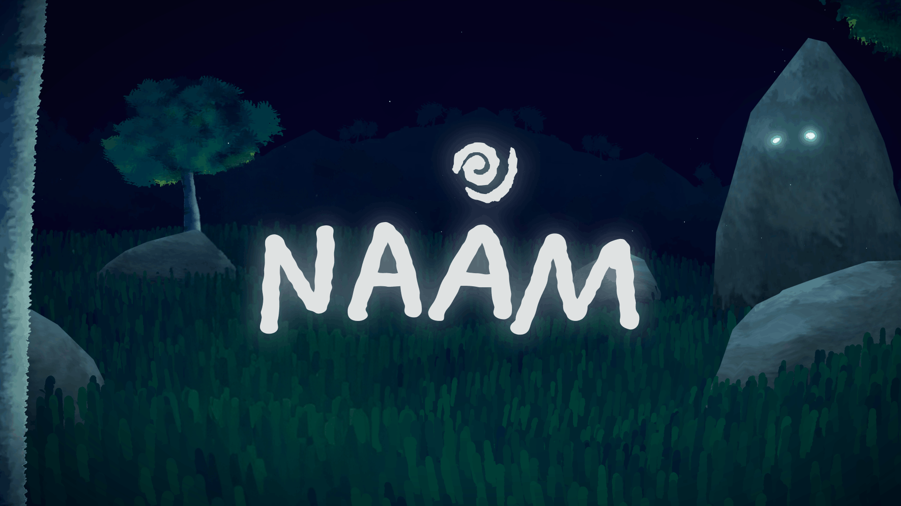

# Nâam



Rejeté par les siens, Nâam, un petit être de la forêt quitte son village et s'enfonce seul dans la forêt. Guidé par une étrange présence lumineuse, il traverse différents paysages et découvre peu à peu ses origines, jusqu'à trouver la place qui lui était destinée.

## Technologies

- Three.js
- WebGPU
- TSL (Three.js Shading Language)
- TypeScript
- Vite

## Installation

Clonez le dépôt puis installez les dépendances :

```bash
pnpm install
```

Lancez le serveur de développement :

```bash
pnpm run dev
```

## Équipe

Projet réalisé en groupe dans le cadre du Master Expert en Création Numérique Interactive (ECNI) à Gobelins.
